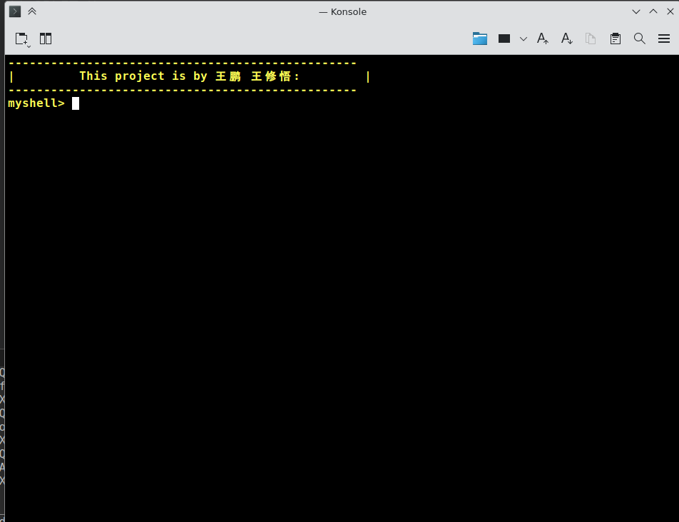
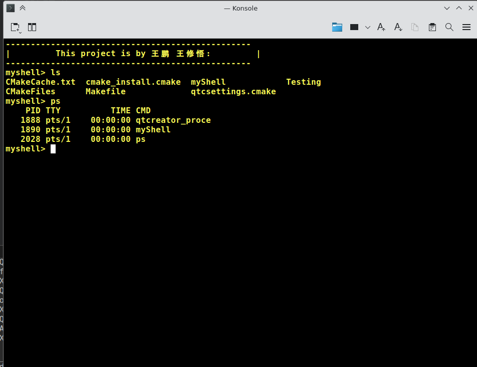
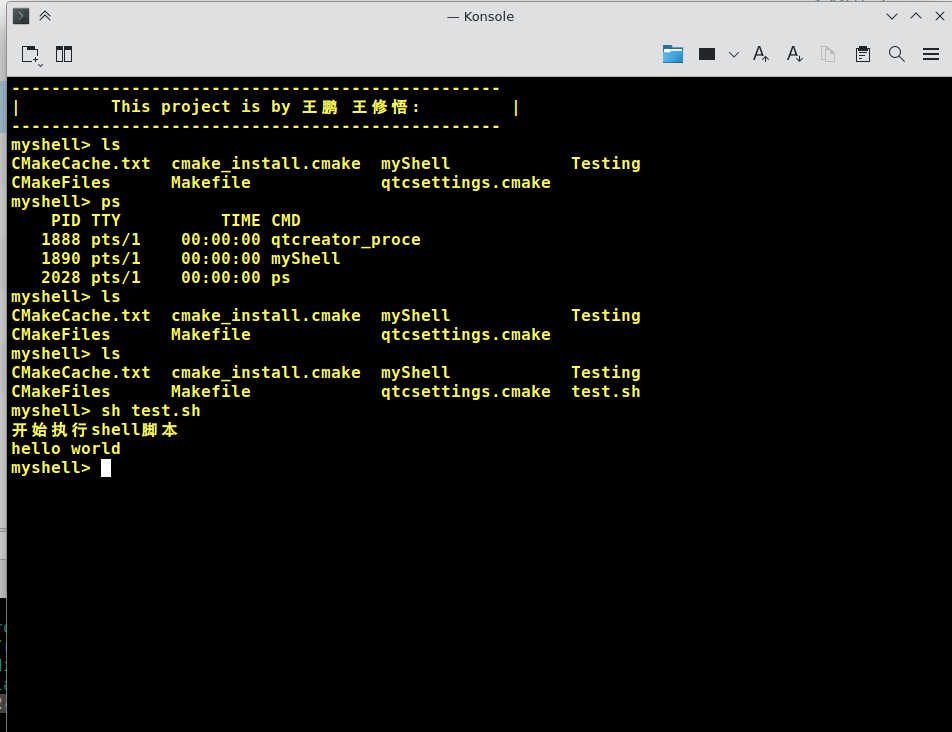
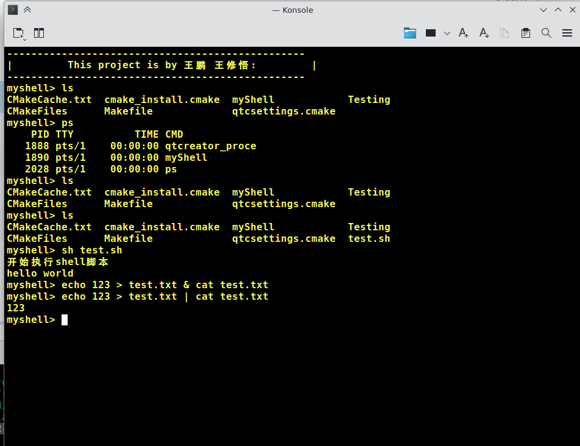
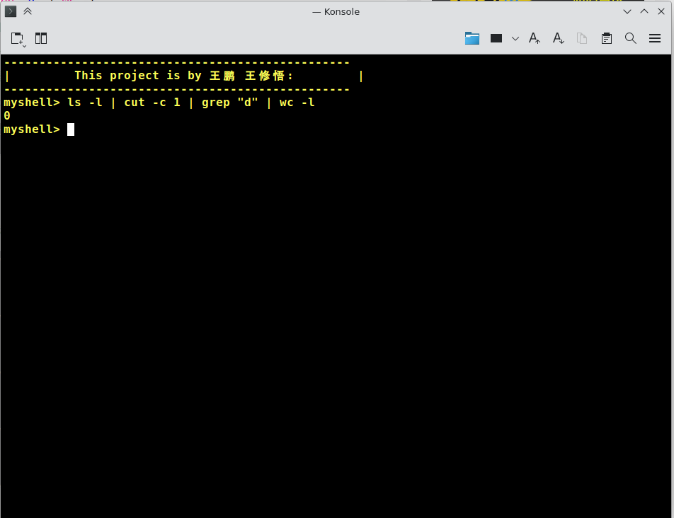

# CQNU-2024-C++实训

## 项目简介

 linux 下的 Shell程序

## 成员
|成员|学号|
|---|---|
|王鹏|2021051615312|
|王修悟|2021051615169|


## 程序功能

1. shell 程序能够提供命令的输入,执行并显示执行结果的功能: **已实现**

<!--  -->


2. shell 程序能够提供可 shell 编程的功能,能够执行简单的 shell 脚本: **已实现**

3. shell 程序能够提供 I/O 重定向和管道的功能: **已实现**



## 程序目录

./src: 源代码
./image: 图片资源
./项目演示视频: 演示视频
./项目演示文档: 演示文档

## 使用方法

```
git clone https://github.com/XSeellAlax/myShell.git

mkdir ./build & cd ./build

cmake ../src/

make & ./myShell
```


